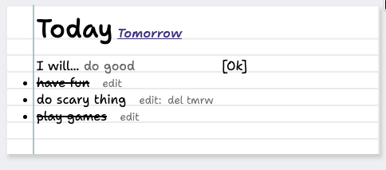

# tmrw

A virtual TODO list. Online at <https://tmrw.j0.lol>.



Tmrw is an experimental piece of software for writing ADHD friendly todo lists. The idea is that since we are bad at temporal perception, the "temporal scope" of your list is resricted as much as possible. You do it today, or tomorrow. 

Of course, this cannot model everything that one can do. Calendars exist for a reason. This is to help you get through the day. This app rewards you for doing tasks by letting you cross them off. Crossed off tasks is a clear indicator of progress, and something to be enjoyed.

This software was developed for myself, but I hope it can be enjoyed by other people. If you have experiences with the software that you would like to share, [please do so](https://j0.lol/contact).

To help with comprehension, everything is dead simple. Every time you visit the website, you are given a login code. Go onto another device and submit the login code to share the same list. This is an easy way to share a login without having to deal with email, usernames, passwords, etc.

## Usage

Build system is kept intentionally light. While `sass` is used for CSS-preprocessing, the processing is done within a Rust dependency, so you do not need the Node tool for building the project.

You need the Rust toolchain to run this project. [Rustup](https://rustup.rs) will get you setup with that, if needed.
```
PORT=2999 cargo run -r
```

Default port is 3000.